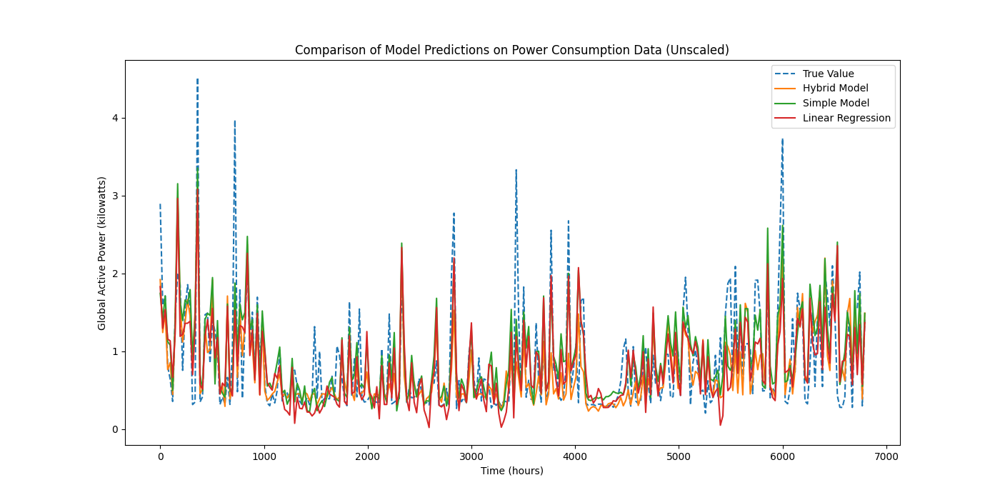

# Technical report: Forecasting household power consumption with hybrid LSTM-Fourier model
_Prepared by: Dr. Franz Buchmann_

## Executive Summary

This report explores a new method for predicting household power consumption—an essential task for efficient energy management and grid optimization. Three forecasting techniques were evaluated:
- Linear Regression: A basic approach positing a linear relationship.
- LSTM Model: An advanced neural network that learns patterns over time.
- Hybrid Model (LSTM + Fourier Features): A novel approach that enhances the LSTM by incorporating known cycles (daily, weekly, and annual patterns) through Fourier features.

The key takeaway is that the Hybrid model outperformed the other methods by reducing forecasting errors by over 8%. This improvement means that by explicitly accounting for routine power usage patterns, energy providers can better anticipate demand, leading to more reliable service and direct cost savings.

## Introduction

Forecasting household power consumption is critical for energy management and grid optimization. While simple models like linear regression capture basic trends, they often miss the cyclical patterns inherent in power usage. LSTM networks are designed to learn temporal dependencies, but even these may struggle with the strong periodicity present in the data. Power consumption typically follows daily routines, weekly cycles, and even annual trends, driven by human behavior and seasonal variations. To address this, our approach augments an LSTM model with deterministic Fourier features that explicitly encode these cycles. This integration leverages domain knowledge to help the model focus on periodic patterns, leading to improved accuracy.

## Dataset
The analysis uses the “Individual Household Electric Power Consumption” dataset, which is publicly available from the UCI Machine Learning Repository. This dataset contains measurements of electric power consumption in one household with a one-minute sampling rate over a period of almost 4 years. For our study, the data was resampled into hourly averages and segmented into weekly sliding windows (of 168 hours) to capture both short-term fluctuations and longer-term seasonal patterns.

You can access more details about the dataset here:

[Individual Household Electric Power Consumption Dataset](https://archive.ics.uci.edu/dataset/235/individual+household+electric+power+consumption)

## Methodology

We implemented and compared three models:
1. **Linear Regression Baseline:**
A simple Keras model that flattens a 168-hour (i.e. one week) input sequence and feeds it through a single Dense layer with linear activation.
2. **LSTM Model:**
A simple LSTM architecture that processes the sequential power consumption data to capture temporal dependencies.
3. **Hybrid Model:**
A simple LSTM model enhanced with a parallel branch that processes deterministic Fourier features. These features are derived from the target timestamps and encode known periodicities (daily, weekly, and annual cycles).

The dataset—resampled to hourly averages—was segmented into weekly sliding windows (of 168 hours). All models were trained under consistent conditions (80% training, 20% testing, 20 epochs, and a batch size of 32). After training, predictions were inverse-transformed to the original scale, and performance was measured using MSE and MAE.

## Experimental Results

The table below summarizes the performance of the models, along with the percentage change in error metrics relative to the Linear Regression baseline.

| **Model**            | **MSE**   | **% Change in MSE** | **MAE**   | **% Change in MAE** |
|----------------------|----------|---------------------|----------|---------------------|
| Linear Regression   | 0.261140 | Baseline            | 0.360328 | Baseline            |
| LSTM Model         | 0.257532 | -1.38%              | 0.359575 | -0.21%              |
| Hybrid Model   | **0.239767** | **-8.18%**          | **0.33405** | **-7.30%**          |

The LSTM model achieved a modest 1.38% improvement in MSE over the baseline, but its MAE was only slightly better by about 0.21%. In contrast, the Hybrid model reduced the MSE by approximately 8.18% and the MAE by 7.30% compared to the baseline.

The above figure (Figure: Comparison of Model Predictions on Power Consumption Data) visualizes how each model’s predictions compare to the true consumption values (dashed blue line). The orange curve represents the Hybrid Model’s forecasts, the green curve shows the standard LSTM model’s predictions, and the red curve depicts the Linear Regression baseline. By comparing the overlap and deviations among these lines, one can see the Hybrid Model following the true consumption pattern more closely, especially around the pronounced peaks and troughs where the other models exhibit larger errors.

## Discussion

The improvement achieved by the Hybrid model highlights the value of incorporating domain-specific knowledge into forecasting models. Household power consumption data are driven by recurring daily routines, weekly behavioral patterns, and seasonal changes. By transforming the target timestamp into deterministic Fourier features (using sine and cosine functions for different harmonics), the Hybrid model is explicitly informed about these periodic cycles. This external injection of cyclic information complements the LSTM approach, helping the neural net to disentangle seasonal effects from other sources of variability.

While the standard LSTM did capture some temporal dynamics, it appears that without the explicit periodic cues provided by Fourier features, it was less effective in fully modeling the recurring patterns. In practical terms, this means that for applications where seasonal trends play a critical role, such as energy forecasting, explicitly incorporating Fourier features can lead to more reliable predictions.

## Conclusion

The experimental results demonstrate that a Hybrid LSTM-Fourier model can outperform both a Linear Regression baseline and a standard LSTM model. The explicit modeling of periodic behavior through Fourier features provides a clear advantage, reducing forecasting errors by over 8% in terms of MSE relative to the baseline. These findings suggest that leveraging domain-specific features can be a powerful strategy in time series forecasting, particularly for data with inherent cyclical patterns such as household power consumption.